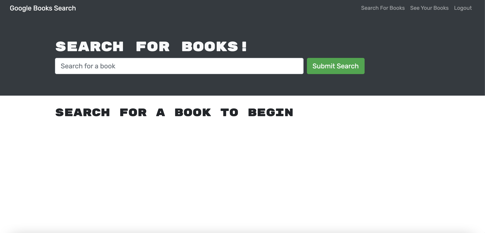

# Book Search Engine

## Book Search Engine Description

This application is designed to assist avid readers in keeping track of their favorite books through the use of the MERN Stack. Through the use of MERN, user's can search, save, and delete books on their personalized accounts. Recommended application to use is Heroku. Future development will prioritize a fix in deletion speed.

## Using application

To use this application, visit the deployed application: https://nameless-waters-20550.herokuapp.com/

## Installing application

To install this application for development, either clone this repository or download directly through a zip file. Ensure you're running it on VS-Code. Make sure to use npm to install all necessary packages. Start through using the "npm start".